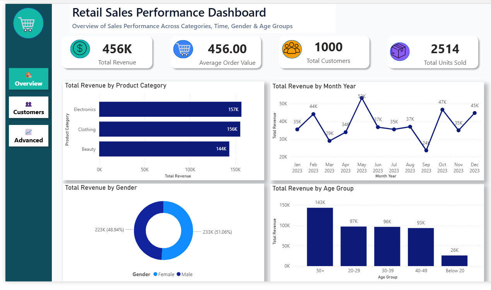
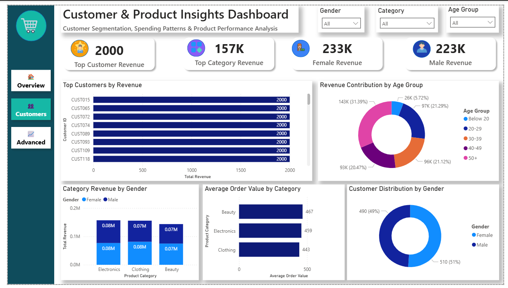

# Retail Sales Analysis Dashboard

## Project Overview

This project analyzes retail sales data using SQL and Power BI to uncover customer behavior, product performance, sales trends, and business insights.

## Tools Used

- SQL (MySQL)
- Power BI
- Excel

---

## Project Components

### SQL Analysis

- Data Quality Checks
- Exploratory Data Analysis (EDA)
- Business Analysis
- Advanced SQL (CTE, Window Functions, Ranking)

### Power BI Dashboard

#### Page 1: Sales Overview
- Total Revenue
- Average Order Value
- Total Customers
- Total Units Sold
- Revenue by Category
- Monthly Revenue Trend
- Revenue by Gender
- Revenue by Age Group

#### Page 2: Customer & Product Insights
- Top Customers by Revenue
- Revenue Contribution by Age Group
- Revenue by Gender & Category
- Average Order Value by Category
- Customer Distribution by Gender

#### Page 3: Business Performance & Advanced Insights
- Highest Monthly Revenue
- Top Category Revenue
- Highest Customer Revenue
- Revenue per Customer
- Monthly Revenue Trend
- Revenue Ranking by Category
- Monthly Revenue Matrix
- Cumulative Revenue Growth

---

## Key Business Insights

- Electronics generated the highest revenue.
- Clothing achieved the highest sales volume.
- Revenue peaked during May 2023.
- Customers aged 50+ contributed the largest revenue share.
- Male and Female revenue contributions remained balanced.
- Average Order Value remained around ₹456.

---

## Dashboard Screenshots

### Overview Dashboard



### Customer & Product Insights



### Business Performance Dashboard


---

## Repository Structure

```text
Retail-Sales-Analysis
│
├── Documentation
├── Power BI
├── SQL
├── Screenshots
└── README.md
```

---

## Author

Asif Abbas
Data Analytics | SQL | Power BI | Python
